# GRE Vocabulary — Group 2 | Day 2

## Theme: Praise, Criticism & Contempt

Today’s goal is not to memorize 15 isolated definitions.

The goal is to build a **mental network** around one emotional spectrum:

```text
PRAISE  →  FORMAL APPROVAL  →  WARNING  →  SHARP CRITICISM  →  HARSH ATTACK  →  CONTEMPT
```

GRE Verbal often tests whether you can detect the **tone** of a sentence. Two answer choices may both feel negative, but one may mean *gentle warning*, another may mean *formal disapproval*, and another may mean *extreme character attack*.

So today, learn each word in two ways:

```text
1. Visual memory  →  what scene should come to mind?
2. GRE function   →  where does the word sit on the praise–criticism scale?
```

---

# 🟢 Cluster 1 — Praise

These five words are positive, but they differ in intensity and setting.

```text
COMMEND  →  LAUD  →  ACCLAIM  →  EXTOL  →  EULOGIZE
measured     high      public      enthusiastic   formal speech
approval     praise    recognition elaborate      of praise
```

---

# 1. Laud

**LAUD** *(verb)*

## Pronunciation

```text
lawd
```

## English Meaning

To praise someone or something highly, especially in a public or formal way.

## Hindi Meaning

बहुत प्रशंसा करना / सार्वजनिक रूप से सराहना करना

## 🧠 Visual Memory

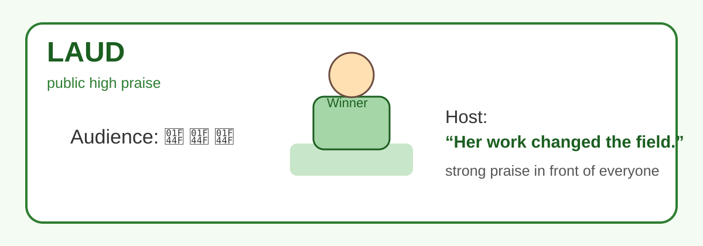

Imagine a scientist standing on a stage after developing an important medical test. The audience is applauding, the host is listing her achievements, and everyone is openly recognizing her contribution.

> Host: “Her work has changed what is possible in affordable diagnostics.”

That is **LAUD**.

## Memory Hook

```text
Laud → loud praise
```

When praise is strong, respectful, and public, imagine it being spoken **loudly** in front of an audience.

## GRE Synonyms

```text
praise
commend
acclaim
extol
```

## Antonyms

```text
criticize
condemn
censure
```

## Usage Paragraph

The committee **lauded** the researcher for designing an inexpensive diagnostic tool. Senior scientists praised both the originality of her method and its social impact. The recognition was not casual; it was public, formal, and deeply respectful.

## GRE Connections / Distinctions

**Laud** is stronger than ordinary praise. It often appears when the sentence suggests public recognition or formal approval. In Sentence Equivalence, it can pair with **extol** or **acclaim**, depending on the context.

---

# 2. Extol

**EXTOL** *(verb)*

## Pronunciation

```text
ik-STOHL
```

## English Meaning

To praise someone or something enthusiastically and often at length.

## Hindi Meaning

बहुत बढ़-चढ़कर प्रशंसा करना / गुणगान करना

## 🧠 Visual Memory

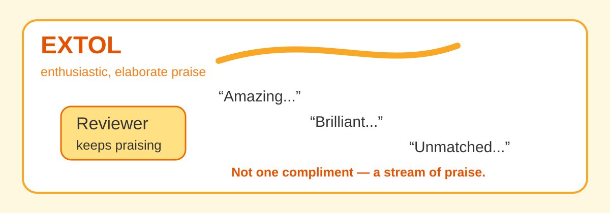

Imagine your friend returns from a Japan trip and cannot stop praising it.

> “The trains were perfect.”  
> “The food was unbelievable.”  
> “Kyoto was magical.”  
> “Tokyo was the best city I have ever seen.”

He is not giving one compliment. He is pouring out praise again and again. That is **EXTOL**.

## Memory Hook

```text
EXTOL → EXTreme praise
```

## GRE Synonyms

```text
laud
glorify
exalt
praise enthusiastically
```

## Antonyms

```text
disparage
denigrate
condemn
criticize
```

## Usage Paragraph

The travel writer **extolled** the beauty of the mountain village, describing its landscape, architecture, food, and hospitality in glowing detail. Her admiration filled nearly every paragraph. The village was not merely recommended; it was celebrated with intense enthusiasm.

## GRE Connections / Distinctions

**Extol** is more enthusiastic than **commend**. If someone praises something with energy and elaboration, **extol** is more precise than simple “praise.”

```text
Commend = controlled approval
Extol   = enthusiastic praise
```

---

# 3. Acclaim

**ACCLAIM** *(verb / noun)*

## Pronunciation

```text
uh-KLAYM
```

## English Meaning

To praise enthusiastically and publicly; as a noun, public praise or recognition.

## Hindi Meaning

सार्वजनिक प्रशंसा / जोरदार सराहना

## 🧠 Visual Memory

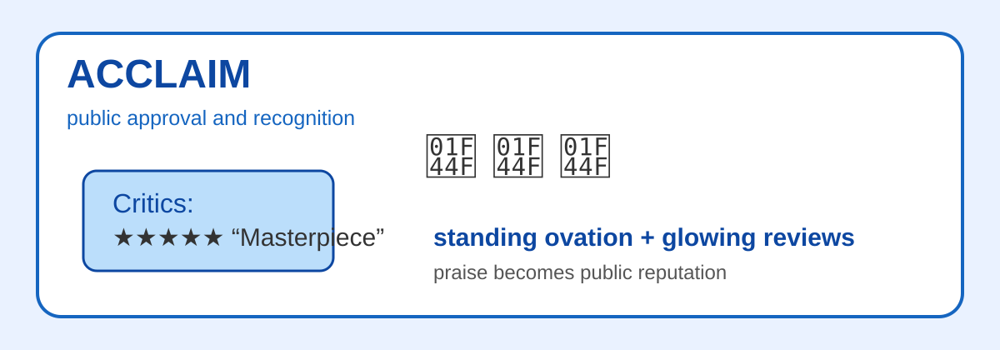

Imagine a film premiere. The movie ends, critics stand up, the audience claps, and newspapers publish glowing reviews the next morning.

> “A masterpiece.”  
> “The film of the year.”  
> “A stunning achievement.”

The movie receives **ACCLAIM**.

## Memory Hook

```text
Acclaim = applause + claim of excellence
```

## GRE Synonyms

```text
laud
applaud
celebrate
praise publicly
```

## Antonyms

```text
condemn
criticize
denounce
```

## Usage Paragraph

The novelist’s first book was **acclaimed** by critics for its unusual structure and emotional depth. Within months, it had received awards and glowing reviews from major literary journals. Despite the widespread **acclaim**, the author remained modest.

## GRE Connections / Distinctions

The phrase **critically acclaimed** is common. **Acclaim** almost always carries a sense of public recognition, so it is stronger and more public than private approval.

```text
Acclaim = public praise + recognition
```

---

# 4. Commend

**COMMEND** *(verb)*

## Pronunciation

```text
kuh-MEND
```

## English Meaning

To praise formally or express approval of someone’s action or behavior.

## Hindi Meaning

सराहना करना / प्रशंसा करना

## 🧠 Visual Memory

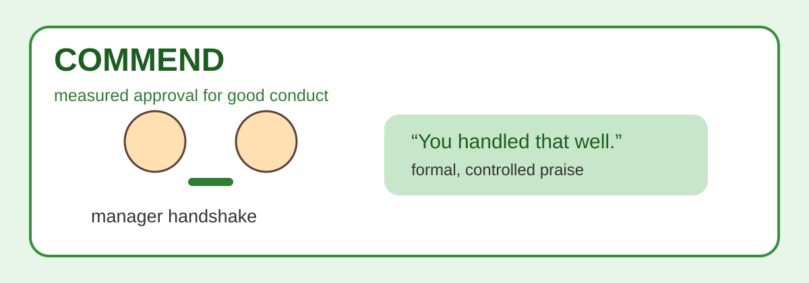

Imagine a manager shaking an employee’s hand after a difficult client meeting.

> Manager: “You handled that situation very professionally.”

The praise is respectful and clear, but not dramatic. That is **COMMEND**.

## Memory Hook

```text
Commend → commendation
```

A **commendation** is an official expression of praise.

## GRE Synonyms

```text
praise
compliment
approve
laud
```

## Antonyms

```text
rebuke
reprimand
criticize
censure
```

## Usage Paragraph

The director **commended** the team for completing the project ahead of schedule without reducing quality. She specifically praised their coordination, discipline, and attention to detail. Her tone was appreciative, formal, and measured.

## GRE Connections / Distinctions

**Commend** is milder than **extol** or **laud**. It is often used when someone deserves recognition for good conduct, service, or performance.

```text
Commend = formal approval
Censure = formal disapproval
```

This opposite pair is very important for GRE.

---

# 5. Eulogize

**EULOGIZE** *(verb)*

## Pronunciation

```text
YOO-luh-jyz
```

## English Meaning

To praise someone highly in a formal speech; often used when speaking at a memorial.

## Hindi Meaning

गुणगान करना / श्रद्धांजलि देते हुए प्रशंसा करना

## 🧠 Visual Memory

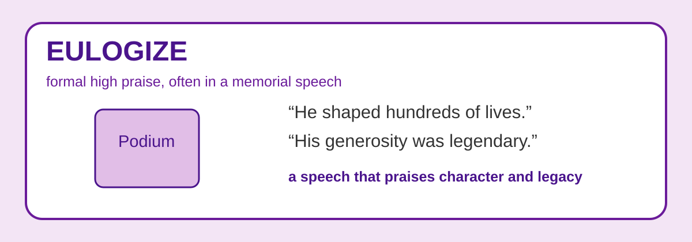

Imagine a memorial service. A former student stands at a podium and speaks about a professor who shaped many lives.

> “He was demanding, but he was also generous. He gave his students courage when they had none.”

That formal speech of praise is **EULOGIZING**.

## Memory Hook

```text
Eulogy → Eulogize
```

A **eulogy** is a formal speech of praise, especially after someone’s death.

## GRE Synonyms

```text
praise
extol
celebrate
glorify
```

## Antonyms

```text
criticize
denigrate
vilify
```

## Usage Paragraph

At the memorial, several former students **eulogized** the professor as a brilliant scientist and a generous mentor. They recalled how he challenged them intellectually while supporting them personally. Their speeches praised not only his achievements but also his character.

## GRE Connections / Distinctions

Do not memorize **eulogize** as only “praise a dead person.” That is a common context, but the deeper meaning is **formal high praise**, usually in speech.

```text
Eulogize = formal speech of praise
Vilify   = extreme negative portrayal
```

---

# 🔴 Cluster 2 — Criticism and Disapproval

Now we move from praise to criticism.

These words are not identical. The GRE can easily trap you if you treat all of them as “criticize.”

```text
ADMONISH  →  REPROACH  →  REBUKE  →  CENSURE  →  CASTIGATE
warning      disappointed sharp       formal      extremely harsh
+ correction criticism    disapproval disapproval criticism
```

---

# 6. Censure

**CENSURE** *(verb / noun)*

## Pronunciation

```text
SEN-shur
```

## English Meaning

To express strong formal disapproval.

## Hindi Meaning

कड़ी औपचारिक निंदा करना

## 🧠 Visual Memory

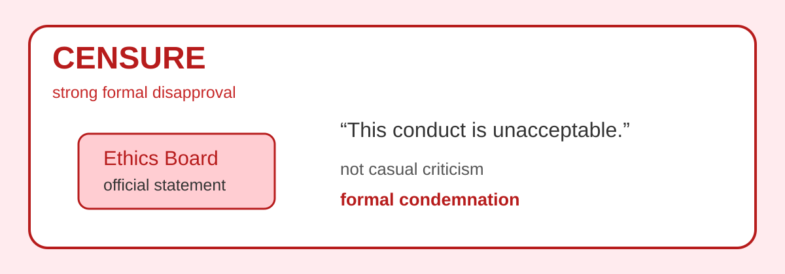

Imagine an ethics board investigating a senior official. After reviewing the evidence, the board releases a formal statement.

> “The member’s conduct violated professional standards.”

This is not gossip. This is not casual criticism. It is official disapproval. That is **CENSURE**.

## Memory Hook

```text
Censure = serious official criticism
```

## GRE Synonyms

```text
condemn
reprimand
rebuke
denounce
```

## Antonyms

```text
commend
praise
approve
laud
```

## Usage Paragraph

The board **censured** the executive for failing to disclose a conflict of interest. Although he was not removed from his position, the formal statement made clear that his behavior was unacceptable. The **censure** damaged his credibility within the organization.

## GRE Connections / Distinctions

**Censure** has an official or formal tone. It is stronger than casual criticism but not necessarily as emotionally explosive as **castigate**.

```text
Commend = formal praise
Censure = formal disapproval
```

---

# 7. Castigate

**CASTIGATE** *(verb)*

## Pronunciation

```text
KAS-tuh-gayt
```

## English Meaning

To criticize or reprimand someone very severely.

## Hindi Meaning

बहुत कठोर आलोचना करना / बुरी तरह फटकारना

## 🧠 Visual Memory

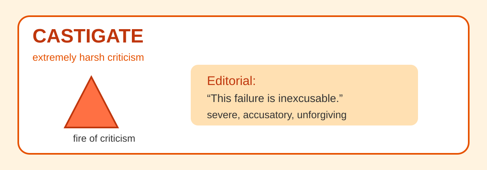

Imagine a newspaper editorial after a bridge collapses because officials ignored repeated warnings.

> “This was not an accident. It was negligence. It was unforgivable.”

The tone is furious, severe, and accusatory. That is **CASTIGATE**.

## Memory Hook

```text
Castigate → catastrophic criticism
```

## GRE Synonyms

```text
berate
lambaste
excoriate
severely condemn
```

## Antonyms

```text
praise
commend
applaud
laud
```

## Usage Paragraph

The editorial **castigated** the government for ignoring repeated warnings about the unsafe bridge. The writers did not describe the collapse as a simple mistake; they portrayed it as the predictable result of negligence. Their language was severe, angry, and unforgiving.

## GRE Connections / Distinctions

**Castigate** is an intensity word. It is much stronger than **admonish** or **rebuke**.

```text
Admonish = warn/correct
Rebuke   = sharply criticize
Castigate = severely attack
```

If the sentence has a mild tone, **castigate** is too strong.

---

# 8. Rebuke

**REBUKE** *(verb / noun)*

## Pronunciation

```text
ree-BYOOK
```

## English Meaning

To express sharp disapproval of someone’s behavior.

## Hindi Meaning

डाँटना / कड़ी फटकार लगाना

## 🧠 Visual Memory

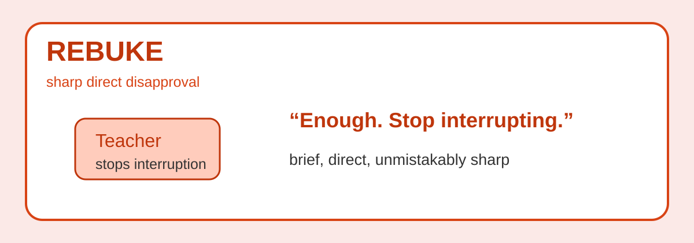

Imagine a student repeatedly interrupting a professor during class. After several interruptions, the professor stops and says:

> “That is enough. Stop interrupting other people.”

The correction is direct, sharp, and public. That is a **REBUKE**.

## Memory Hook

```text
Rebuke = sharp verbal push-back
```

## GRE Synonyms

```text
reprimand
scold
admonish
reproach
```

## Antonyms

```text
praise
approve
commend
encourage
```

## Usage Paragraph

The chairperson **rebuked** the member for repeatedly interrupting the discussion. Her words were brief, but the disapproval was unmistakable. The room became quiet because everyone understood that the behavior had crossed a line.

## GRE Connections / Distinctions

**Rebuke** is sharper than **admonish** but usually less extreme than **castigate**.

```text
Admonish = warning + correction
Rebuke   = sharp disapproval
```

---

# 9. Admonish

**ADMONISH** *(verb)*

## Pronunciation

```text
ad-MON-ish
```

## English Meaning

To warn or mildly reprimand someone, often with the aim of correcting behavior.

## Hindi Meaning

चेतावनी देना / समझाते हुए डाँटना

## 🧠 Visual Memory

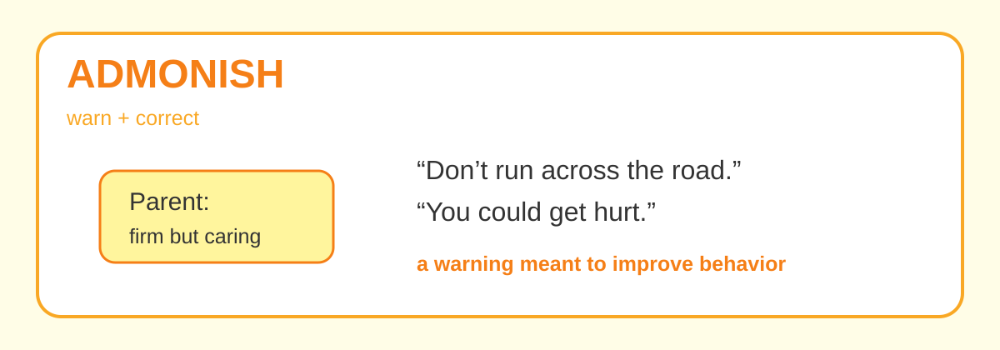

Imagine a parent firmly telling a child not to run across a busy road.

> “Don’t do that again. You could get seriously hurt.”

The parent is not merely angry. The purpose is correction and protection. That is **ADMONISH**.

## Memory Hook

```text
Admonish = advise + warn
```

## GRE Synonyms

```text
warn
caution
reprimand
counsel
```

## Antonyms

```text
encourage
praise
approve
commend
```

## Usage Paragraph

The supervisor **admonished** the intern for arriving late three times in one week. She explained that punctuality affected the entire team’s schedule and warned him not to repeat the mistake. Her tone was firm, but the goal was improvement rather than humiliation.

## GRE Connections / Distinctions

**Admonish** often contains advice or warning. GRE may use it in contexts where a teacher, parent, mentor, or supervisor corrects someone.

```text
Admonish = correction with warning
Castigate = severe attack
```

---

# 10. Reproach

**REPROACH** *(verb / noun)*

## Pronunciation

```text
ree-PROHCH
```

## English Meaning

To criticize someone with disappointment or moral disapproval.

## Hindi Meaning

उलाहना देना / निराशा के साथ आलोचना करना

## 🧠 Visual Memory

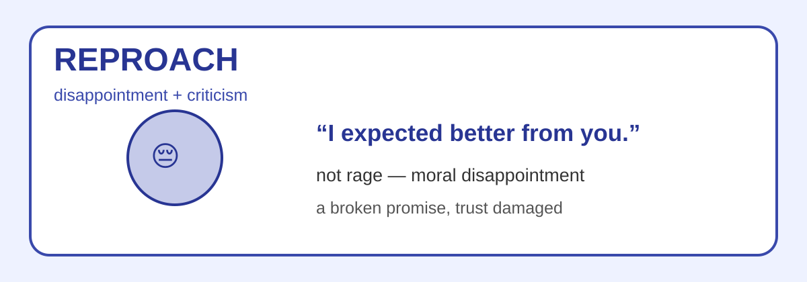

Imagine a close friend finding out that you broke an important promise.

> “I expected better from you.”

The feeling is not just anger. It is disappointment. That disappointed criticism is **REPROACH**.

## Memory Hook

```text
Reproach = disappointment + criticism
```

## GRE Synonyms

```text
rebuke
blame
chide
criticize
```

## Antonyms

```text
praise
approve
compliment
commend
```

## Usage Paragraph

She **reproached** her colleague for taking credit for work the entire team had completed. Her tone conveyed disappointment as much as anger because she had trusted him to behave fairly. The criticism felt personal because he had failed to meet a moral expectation.

## GRE Connections / Distinctions

**Reproach** often carries emotional disappointment. It can be quiet but heavy.

```text
Rebuke   = sharp correction
Reproach = disappointed criticism
```

---

# 🟣 Cluster 3 — Belittling, Mockery and Contempt

These words go beyond criticism.

Now the speaker is trying to reduce someone’s value, mock them, treat them with contempt, or attack their character.

```text
DISPARAGE  →  DENIGRATE  →  DERIDE  →  SCORN  →  VILIFY
belittle      damage worth   mock       contempt  make villain
```

---

# 11. Disparage

**DISPARAGE** *(verb)*

## Pronunciation

```text
dih-SPAIR-ij
```

## English Meaning

To speak about someone or something in a way that makes it seem less valuable, less important, or less worthy.

## Hindi Meaning

नीचा दिखाना / महत्व कम करके दिखाना

## 🧠 Visual Memory

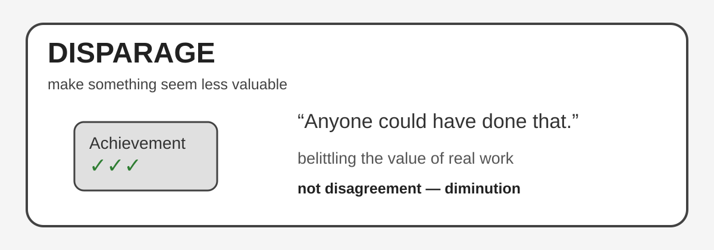

Imagine someone finishes a difficult project after weeks of work. Another person looks at it and says:

> “What is so special? Anyone could have done that.”

The speaker is trying to reduce the value of the achievement. That is **DISPARAGE**.

## Memory Hook

```text
Disparage = decrease apparent value
```

## GRE Synonyms

```text
belittle
denigrate
demean
deprecate
```

## Antonyms

```text
praise
esteem
exalt
commend
```

## Usage Paragraph

The critic **disparaged** the young artist’s paintings as fashionable imitations. Instead of examining the work seriously, he minimized its originality and technical skill. His comments were designed to lower the reader’s opinion of the artist.

## GRE Connections / Distinctions

**Disparage** does not mean simply disagree. It means to belittle or reduce perceived value.

```text
Disparage ≈ Denigrate
```

This is a strong Sentence Equivalence pair.

---

# 12. Denigrate

**DENIGRATE** *(verb)*

## Pronunciation

```text
DEN-ih-grayt
```

## English Meaning

To unfairly criticize or belittle someone’s reputation, worth, or achievements.

## Hindi Meaning

बदनाम करना / नीचा दिखाना

## 🧠 Visual Memory

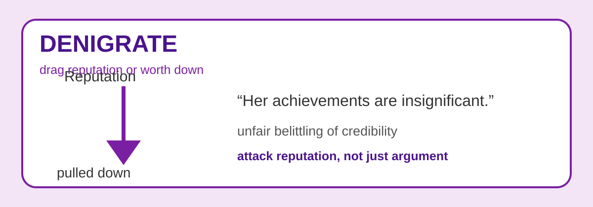

Imagine two candidates competing for a promotion. One candidate does not explain why he is good. Instead, he keeps saying that the other candidate’s achievements are insignificant.

He is trying to pull her reputation down. That is **DENIGRATE**.

## Memory Hook

```text
Denigrate → drag reputation down
```

## GRE Synonyms

```text
disparage
belittle
demean
defame
```

## Antonyms

```text
praise
honor
exalt
commend
```

## Usage Paragraph

Rather than defend his proposal on its merits, the candidate tried to **denigrate** his opponent’s experience. He repeatedly suggested that her achievements were minor, even though the evidence showed otherwise. His strategy was to reduce her credibility instead of strengthening his own case.

## GRE Connections / Distinctions

**Denigrate** often targets reputation or worth. Compared with **disparage**, it can feel more personal because it attacks credibility.

```text
Disparage = belittle value
Denigrate = belittle reputation/worth
```

---

# 13. Deride

**DERIDE** *(verb)*

## Pronunciation

```text
dih-RYD
```

## English Meaning

To mock or ridicule someone or something contemptuously.

## Hindi Meaning

मज़ाक उड़ाना / उपहास करना

## 🧠 Visual Memory

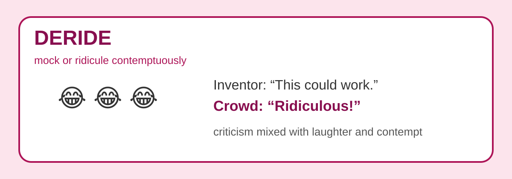

Imagine an inventor presenting an unusual machine. Before testing it, the audience starts laughing.

> “That is ridiculous.”  
> “Who would ever believe this could work?”

They are not just criticizing the idea; they are mocking it. That is **DERIDE**.

## Memory Hook

```text
Deride → ridicule
```

Both words carry the idea of mockery.

## GRE Synonyms

```text
mock
ridicule
jeer at
scoff at
```

## Antonyms

```text
respect
praise
admire
commend
```

## Usage Paragraph

Many experts initially **derided** the inventor’s proposal as unrealistic and absurd. They joked about it in public forums rather than examining the evidence seriously. Years later, a successful prototype forced several of those critics to reconsider.

## GRE Connections / Distinctions

**Deride** specifically involves mockery. If the sentence only suggests criticism without laughter, ridicule, or contemptuous joking, **deride** may not fit.

```text
Disparage = belittle
Deride    = mock
```

---

# 14. Scorn

**SCORN** *(verb / noun)*

## Pronunciation

```text
skorn
```

## English Meaning

To regard or treat someone or something with strong contempt.

## Hindi Meaning

तिरस्कार करना / घृणा और उपेक्षा से देखना

## 🧠 Visual Memory

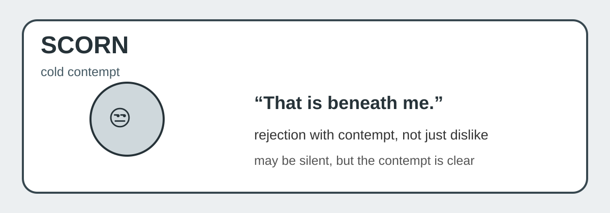

Imagine someone looking at an offer, pushing it away, and saying:

> “That is beneath me.”

The person may not shout. They may not even argue. But the contempt is obvious. That is **SCORN**.

## Memory Hook

```text
Scorn = contempt + rejection
```

## GRE Synonyms

```text
disdain
despise
contemn
look down on
```

## Antonyms

```text
respect
admire
esteem
value
```

## Usage Paragraph

The scholar **scorned** sensational explanations that lacked evidence. He regarded such claims not merely as incorrect but as intellectually irresponsible. His contempt became obvious whenever the subject came up.

## GRE Connections / Distinctions

**Scorn** is about contempt. It does not require long criticism or public mockery.

```text
Deride = mock with laughter
Scorn  = regard with contempt
```

---

# 15. Vilify

**VILIFY** *(verb)*

## Pronunciation

```text
VIL-uh-fy
```

## English Meaning

To speak about someone in an extremely negative way and portray them as wicked, evil, or contemptible.

## Hindi Meaning

किसी को बदनाम करना / किसी को दुष्ट या बहुत बुरा साबित करना

## 🧠 Visual Memory

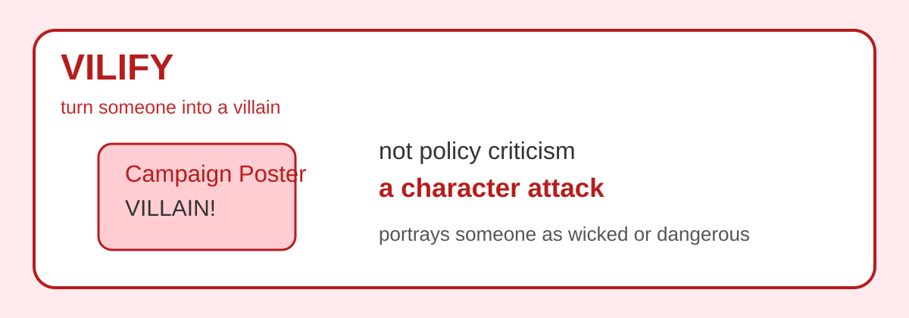

Imagine a political advertisement. It does not simply say:

> “My opponent’s policy is wrong.”

Instead, it says:

> “This person is dangerous, corrupt, and wants to destroy society.”

That is not normal criticism. It is turning someone into a villain. That is **VILIFY**.

## Memory Hook

```text
Vilify → villain
```

To vilify someone is to make them look like a villain.

## GRE Synonyms

```text
malign
defame
slander
denounce
```

## Antonyms

```text
praise
commend
glorify
eulogize
```

## Usage Paragraph

The pamphlet **vilified** the reformer as an enemy of society, attributing malicious motives to nearly everything he did. It did not merely criticize his policies; it attempted to destroy his character and reputation. This extreme portrayal made rational debate almost impossible.

## GRE Connections / Distinctions

**Vilify** is stronger than **criticize**, **disparage**, or **denigrate**. It attacks character and portrays someone as morally bad.

```text
Disparage = make less valuable
Denigrate = lower reputation
Vilify    = portray as wicked
```

---

# 🧠 Day 2 Mental Network

## 1. Praise Cluster

```text
COMMEND
  ↓
measured / formal approval

LAUD
  ↓
strong public praise

ACCLAIM
  ↓
public recognition and approval

EXTOL
  ↓
enthusiastic, elaborate praise

EULOGIZE
  ↓
formal speech of high praise
```

## 2. Criticism Cluster

```text
ADMONISH
  ↓
warning + correction

REPROACH
  ↓
disappointment + criticism

REBUKE
  ↓
sharp direct disapproval

CENSURE
  ↓
formal strong disapproval

CASTIGATE
  ↓
extremely harsh criticism
```

## 3. Contempt Cluster

```text
DISPARAGE
  ↓
make something seem less valuable

DENIGRATE
  ↓
lower someone’s reputation or worth

DERIDE
  ↓
mock or ridicule

SCORN
  ↓
regard with contempt

VILIFY
  ↓
portray as wicked or villainous
```

---

# Important GRE Contrast Blocks

## Commend vs Censure

```text
COMMEND
= formal approval

CENSURE
= formal disapproval
```

## Laud vs Extol

```text
LAUD
= high praise, often public

EXTOL
= enthusiastic and elaborate praise
```

## Admonish vs Rebuke vs Castigate

```text
ADMONISH
= “Do not do this again.”
= warning + correction

REBUKE
= “What you did was unacceptable.”
= sharp disapproval

CASTIGATE
= “This was disgraceful and unforgivable.”
= extremely harsh criticism
```

## Disparage vs Denigrate vs Vilify

```text
DISPARAGE
= reduce the value of something

DENIGRATE
= reduce someone’s reputation or worth

VILIFY
= make someone look evil or villainous
```

## Deride vs Scorn

```text
DERIDE
= mock / ridicule

SCORN
= treat with contempt
```

A person can **scorn** something silently, but to **deride** something usually involves open mockery.

---

# Quick Revision Table

| Word | Core Meaning | Visual Anchor | GRE Pair / Contrast |
|---|---|---|---|
| **Commend** | formal approval | manager handshake | opposite of censure |
| **Laud** | public high praise | award stage | close to extol/acclaim |
| **Acclaim** | public recognition | critics applauding | critically acclaimed |
| **Extol** | enthusiastic praise | nonstop glowing review | close to laud |
| **Eulogize** | formal praise speech | memorial podium | opposite of vilify |
| **Admonish** | warn and correct | parent warning child | milder than rebuke |
| **Reproach** | disappointed criticism | “I expected better” | emotional disapproval |
| **Rebuke** | sharp disapproval | teacher stops interruption | sharper than admonish |
| **Censure** | formal disapproval | ethics board statement | opposite of commend |
| **Castigate** | severe criticism | furious editorial | strongest criticism word |
| **Disparage** | belittle value | “Anyone could do that” | close to denigrate |
| **Denigrate** | lower reputation | reputation pulled down | close to disparage |
| **Deride** | mock/ridicule | laughing crowd | mockery word |
| **Scorn** | contempt | “beneath me” | close to disdain |
| **Vilify** | portray as evil | villain poster | character attack |

---

# Sentence Equivalence Pairs to Remember

```text
Laud ≈ Extol
Laud ≈ Acclaim
Commend ≈ Praise
Censure ≈ Condemn
Rebuke ≈ Reprimand
Castigate ≈ Lambaste
Disparage ≈ Denigrate
Deride ≈ Ridicule
Scorn ≈ Disdain
Vilify ≈ Defame / Malign
```

---

# Mini GRE-Style Practice

## Question 1

The committee did not merely appreciate the scientist’s work privately; it publicly ________ her contribution before the entire academic community.

```text
A. derided
B. lauded
C. admonished
D. disparaged
E. reproached
```

**Answer:** B. **lauded**

**Why:** The sentence says “publicly” and “appreciate,” so we need public praise.

---

## Question 2

The editorial ________ the officials for ignoring safety warnings, describing their negligence as unforgivable.

```text
A. commended
B. extolled
C. castigated
D. acclaimed
E. eulogized
```

**Answer:** C. **castigated**

**Why:** “Negligence” and “unforgivable” indicate extremely harsh criticism.

---

## Question 3

Rather than refute the proposal logically, the speaker tried to ________ it as childish and worthless.

```text
A. disparage
B. commend
C. acclaim
D. eulogize
E. laud
```

**Answer:** A. **disparage**

**Why:** The speaker is reducing the proposal’s value instead of arguing logically.

---

# Final Memory Ladder

```text
PRAISE

Commend → Laud → Acclaim → Extol → Eulogize


CRITICISM

Admonish → Reproach → Rebuke → Censure → Castigate


CONTEMPT

Disparage → Denigrate → Deride → Scorn → Vilify
```

---

# Day 2 Testing Progression

When revising this group, test in this order:

```text
Stage 1: Visual Recall
Look at the image and recall the word.

Stage 2: Core Meaning
State the word in 5–7 words.

Stage 3: Pair Recognition
Match synonym pairs and opposite pairs.

Stage 4: GRE Sentence Completion
Use context and tone to choose the correct word.

Stage 5: Trap Detection
Explain why the tempting wrong answer is wrong.
```

The final stage is the real GRE skill: not just knowing the word, but knowing why a nearby word does **not** fit.
